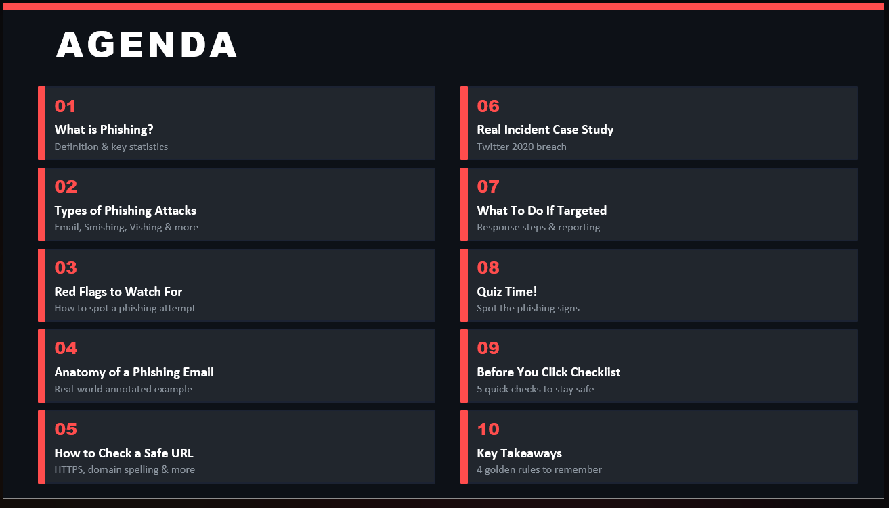

# 🎣 Phishing Awareness Training

## 📌 Project Overview
This project was developed as part of the CodeAlpha Cybersecurity Internship.

The presentation is designed to educate users about phishing attacks, phishing prevention techniques, and cybersecurity awareness best practices.

---

## 🚀 Topics Covered
- What is phishing
- Types of phishing attacks
- Red flags to identify phishing
- Safe URL checking
- Real-world phishing case study
- Response and reporting steps
- Security checklist
- Interactive phishing quiz

---

## 🛠️ Tools Used
- Microsoft PowerPoint
- Cybersecurity Awareness Concepts
- Git & GitHub

---

## 📂 Project Structure

```text
CodeAlpha_PhishingAwareness/
│
├── presentation/
├── screenshots/
├── assets/
├── learning_notes.md
├── README.md
```

---

## 📸 Presentation Screenshots

## Agenda Slide


## Quiz Slide


---

## 🎯 Objective
To spread cybersecurity awareness and help users identify and prevent phishing attacks.

---

## 👨‍💻 Author
Nensi Shingala